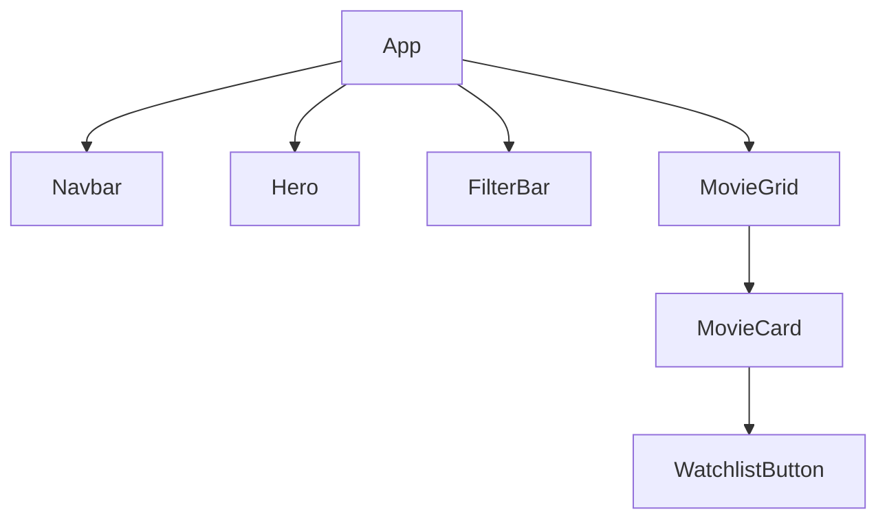

# 🎬 Binge & Box — Discover Movies by Your Mood

**Binge & Box** is a modern, cinematic web application built with React.js that helps users find the perfect movie based on their current "vibe" or mood. Featuring a sleek dark UI with neon accents, it offers a premium browsing experience.

## ✨ Features
- 🌈 **Mood-Based Filtering:** Quick access to movies via "Mood Pills" (Action, Chill, Thriller, etc.).
- 🔍 **Real-time Search:** Instantly find movies by title.
- 📺 **Cinematic UI:** High-quality movie cards with smooth hover animations and neon glow effects.
- 📱 **Fully Responsive:** Optimized for desktops, tablets, and mobile devices.

## 🚀 Tech Stack
- **Frontend:** React.js
- **Styling:** CSS3 (Custom Properties & Keyframes)
- **Icons:** FontAwesome
- **Deployment:** Vercel (Coming Soon)

## 🛠️ Installation & Setup
1. **Clone the repository:**
   ```bash
   git clone [https://github.com/bushra-waseem/binge-box-mood-based-movies.git](https://github.com/bushra-waseem/binge-box-mood-based-movies.git)
   cd binge-box-mood-based-movies
   npm install
   npm start
   ```

 ```mermaid
graph LR
    A[User Selection] -->|Select Mood| B(Filter Engine)
    A -->|Search Title| B
    B -->|Query Data| C[(moviesData.js)]
    C -->|Return Match| D[UI Update]
    D -->|Render| E[Movie Grid]
```



  src/
├── components/     # Reusable UI elements (Navbar, Cards, etc.)
├── data/           # moviesData.js (Local Database)
├── styles/         # Custom CSS with Neon effects
├── App.js          # Main logic & State management
└── index.js        # Entry point```
