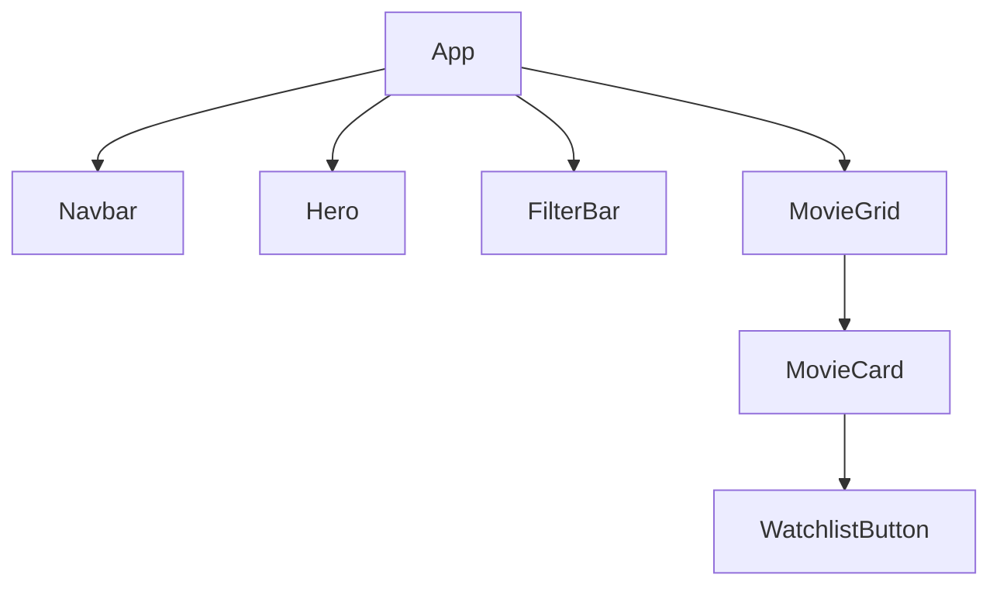
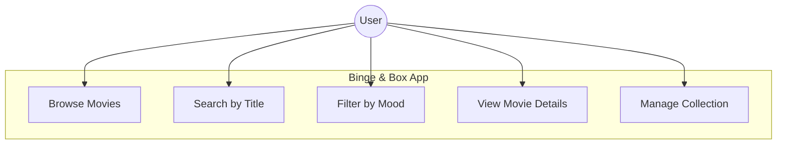

# 🎬 Binge & Box — Discover Movies by Your Mood

**Binge & Box** is a modern, cinematic web application built with React.js that helps users find the perfect movie based on their current "vibe" or mood. Featuring a sleek dark UI with neon accents, it offers a premium browsing experience.

## ✨ Features
- 🌈 **Mood-Based Filtering:** Quick access to movies via "Mood Pills" (Action, Chill, Thriller, etc.).
- 🔍 **Real-time Search:** Instantly find movies by title.
- 📺 **Cinematic UI:** High-quality movie cards with smooth hover animations and neon glow effects.
- 📱 **Fully Responsive:** Optimized for desktops, tablets, and mobile devices.

## 🚀 Tech Stack
- **Backend:** Node.js
- **Frontend:** React.js
- **Styling:** CSS3 (Custom Properties & Keyframes)
- **Icons:** FontAwesome
- **Deployment:** Vercel (Coming Soon)

## 🛠️ Installation & Setup
1. **Clone the repository:**
   ```bash
   git clone [https://github.com/bushra-waseem/binge-box-mood-based-movies.git](https://github.com/bushra-waseem/binge-box-mood-based-movies.git)
   cd binge-box-mood-based-movies
   npm install
   npm start
   ```

 ```mermaid
graph LR
    A[User Selection] -->|Select Mood| B(Filter Engine)
    A -->|Search Title| B
    B -->|Query Data| C[(moviesData.js)]
    C -->|Return Match| D[UI Update]
    D -->|Render| E[Movie Grid]
```




```text
binge-box/
├── backend/                # Main Backend Folder
│   └── backend/            # Nested Server Folder
│       ├── server.js       # Entry point (Node.js)
│       ├── package.json    # Backend Dependencies
│       └── package-lock.json
├── frontend/               # React Application
│   ├── public/             # Static Assets
│   └── src/                # Frontend Logic
│       ├── components/     # Navbar.jsx, etc.
│       ├── pages/          # Home, Login, Movies, etc.
│       ├── App.js          # Routing
│       └── moviesData.js   # Local Movie Database
└── README.md
```

### 🤝 Connect with Me
* **LinkedIn:** (https://www.linkedin.com/in/ bushraa-waseem)

## 📸 App Gallery

<details>
  <summary><b>Click to View Cinematic Interface (10 Screenshots)</b></summary>
  <br>

  ### 🏠 Main Hub & Discovery
| Home Page | Recommended | Trending |
| :---: | :---: | :---: |
|  |  |  |

### 🎬 Content Browsing
| Movies | TV Shows | My List |
| :---: | :---: | :---: |
|  |  |  |

### 🔐 Auth & Others
| About | Contact | Sign In | 
| :---: | :---: | :---: | 
|  |  |  
| Register |
|  |
</details>

